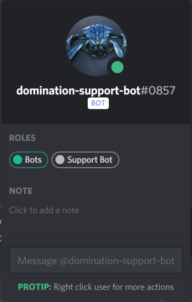

# DomiNATION Discord Bot
DomiNATION Discord Bot is a bot created for the [DomiNATION gaming community](https://domination-gaming.com/).  This was my first project and it sparked my interest into Software Development.  Since starting this, I have enrolled and completed a coding bootcamp to become a Full Stack Java Developer!  DomiNATION Discord Bot, Java Edition, coming soon...?



* Assists both users and staff in day to day operations.
* Has 24 unique commands available (See Command List for full details)
* Performs automated ticket queueing
* Automatically stores message IDs to allow an easy to update Rules list

# Minimum permissions required
* Read Text Channels & See Voice Channels
* Send Messages
* Manage Messages
* Embed Links
* Read Message History
* Add Reactions

# Setup
If you want to use this bot yourself, please feel free to do so but please keep in mind that this was designed for our community.  The prefix can be updated in the `config.json` file.

### Example .env
```
TOKEN=[Your Bot's Token]
GUILD_ID=[Your Discord's ID]

ANNOUNCEMENTS_ID=[Channel ID]
RULES_ID=[Channel ID]
ARK_SUPPORT_ID=[Channel ID]
ATLAS_SUPPORT_ID=[Channel ID]
```

# Command List
This bot has 24 unique and awesome commands.  Some are very simple, and some are very complex.  All commands start with `!` unless you have changed the `prefix` within the `config.json` file.

 Command Name | Description | Example
--------------|-------------| -------------
`addemote` | Adds a custom emote and emoji to the `!emote` list | `!addemote Zaff https://www.website.com/zaffDancing.gif`
`admincommands` | Sends a DM to the user with all administrative commands and detailed descriptions for each one |
`breeder` | Sends a link to a Google Sheet
`commands` | Sends a DM to the user containing all `non-administrative` commands and detailed descriptions for each one
`deleteemote` | Deletes a custom emote from the `!emote` list | `!deleteemote Zaff`
`deleterule` | Deletes a rule | `!deleterule ark 3`
`editevent` | Sets the current `!events` text.  This can take in 2,000 characters. | `!editevent Date:  November 17th, 2019 - 08:00 PM CST ...`
`editrule` | Creates a new rule if it does not exist or edits a pre-existing rule based on rule type and rule number.  *`Note:`  If a new rule is established then `postrules` must be ran* | `!editrule ark 4 README files are fantastic!`
`editserveradmin` | Creates a new admin server listing if it does not exist or edits a pre-existing rule based on server number *`Note:` If a new server admin list is established then `postrules` must be ran* | `editserveradmin 11 Domi Admins Rock, Cydonia, Sanctum`
`emote` | Can be typed by its-self to return the full emotes available, or can accept any argument provided it was created by `addemote` | `!emote wave`
`event` | Sends a DM to the user containing the scheduled events for that month.  List is based solely on the `editevent` command.  `events` was the original command, but I created a secondary command because everyone always forgets the s.....
`events` | Sends a DM to the user containing the scheduled events for that month.  List is based solely on the `editevent` command
`help` | Sends a link to our help form so users may submit a trouble ticket
`mute` | Mutes the tagged user for a certain time, time can be s, m, h, d | `!mute @zaff 60s`
`patreon` | Sends a DM to the user containing our Patreon information
`patrequest` | Sends information to the user on how to claim their monthly Patreon benefits
`postrules` | Posts the information based on `editrules`, `editserveradmin` and our Staff Code of Conduct to the #rules channel, which is defined within the `update.json`
`rule` | Can accept any rule number provided it was created with `addrules`, this only works with the Ark rules | `!rule 7`
`secretme` | Makes the bot send a custom message based on input.  This is only tied to Zaffierce's ID ;) | `!secretme Zaff is awesome <3`
`steamfavorite` | Sends information on how to favorite our servers using Steam's built in server browser
`unmute` | Unmutes the tagged user | `!unmute @zaff`
`website` | Sends the link to our website
`whitelist` | Sends a link to our whitelisting steps, which is available to do so after becoming a Patreon
`wiki` | Can be typed by its-self to return the link to the [Official Ark Wiki](https://ark.gamepedia.com/) or it can accept any argument and return a link, provided one exists | `!wiki Ascencion`

# Thanks to...
* So many StackOverflow links to even remember
* Google!
* Kakoen87
* Discord's Official API & Bots channels
* Discord documentation